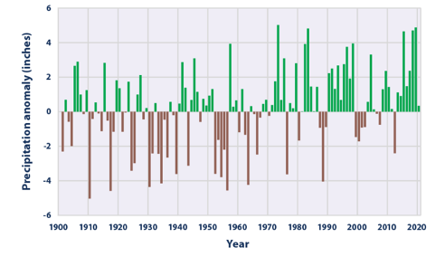
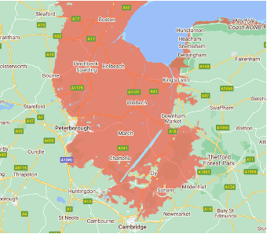
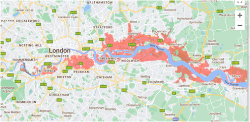
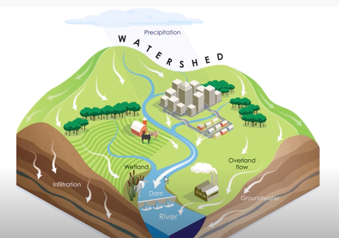
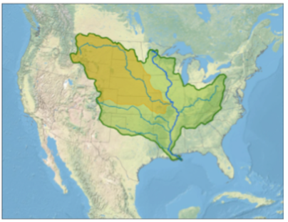
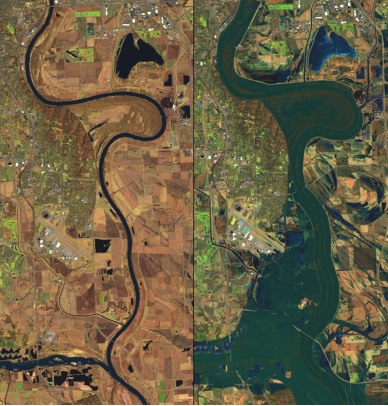
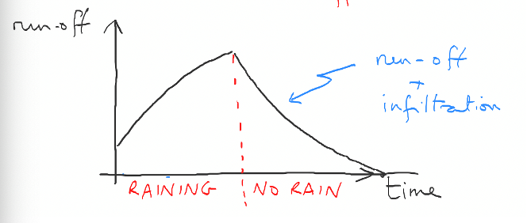
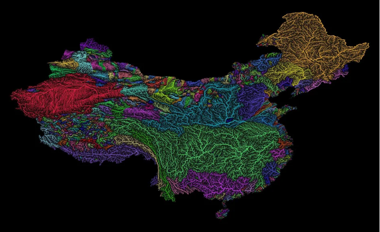

(lecture_13)=
# Lecture 13: Surface water, flooding and impact of climate change


Illustration of the number of major loss events by natural processes, illustrating the very large proportion of such events associated with flooding.

Intense floods often lead to severe damage to property, land and infrastructure and they are becoming one of the main destructive consequences of the more intense rainfall which is a characteristic of global warming coupled with rapid land development which has not maintained adequate water drainage pathways, leading to undercapacity and flooding.
Heavy rainfall events have been building up over time owing to the higher atmospheric temperatures and the associated capacity for the air to carry more moisture.

 



The above charts illustrate the mass of water which can be carried in air with 100% humidity as a function of the temperature, while the top right hand plot shows the increase in land area subject to heavy rainfall events in the US over the past 90 years, and the lower plot illustrates the annual rainfall relative to the average in the US again over the past 90 years.
There is a clear trend towards heavier more intense rain and also of increasing annual rainfall.

Rainfall provides the source for much of the flooding inshore, and occurs when the drainage system is unable to accommodate the water flux associated with rain.
However, sea level rise will also lead to flooding of near coastal areas, and the two maps below illustrate some predictions of those areas of East Anglia and London which may be submerged by 2100 AD with sea level rise predicted by some climate forecasts.





Flooding in East Anglia and London associated with some predictions of sea level rise in the latter part of the present century.

## 1.1 Rainfall and drainage systems

Rainfall typically accumulates on the ground and disperses through three pathways.
First the rain may run over the land surface downhill towards drainage channels, a process we will call surface run-off, $S$, with a flux per unit area.
Second the rain may infiltrate into the ground, flowing into the subsurface aquifers, a process we label with a flux, $D$, per unit area.
Third, some rainfall is taken up by crops and then returned to the atmosphere by the process of evapotranspiration, with a flux, $T$, per unit area of the land.
The controls on these three fluxes are associated with the type of vegetation, the slope of the land and the type of soil which will be more or less permeable, and hence will regulate the flux of water into the ground.
If the surface run-off if too large, then this may lead to overspilling of drainage gullies and channels, and a flood may develop.

Eventually, the drainage and surface run off may reach a river where the flow is localised and moves downstream.
If the flow exceeds the river capacity, the flow will overtop the river banks and flood to the flanks of the river, possibly spreading over the flood plain.



Typically, the upstream topography of the land determines the boundaries between different drainage basins, along lines of maximum elevation known as the watershed.
An example of the Missouri and Mississippi river watersheds in the US is shown on the right hand figure.

 

For illustration, there is a fascinating image of the flooding of the Missouri River taken from satellite to illustrate the flood plain adjacent to the river



To set the scene for modelling runoff, it is important to assess the volume flux involved in different types of rain event.
Light rain may lead to $0.1 \ \mathrm{mm \ hour^{-1}}$; moderate rain $1 \ \mathrm{mm \ hour^{-1}}$ and heavy rain may be $10 \ \mathrm{mm \ hour^{-1}}$.
If a river has a catchment area of $100 \times 100 \ \mathrm{km}$, corresponding to $1010 \ \mathrm{m}^2$ then the volume of rain which falls in 1 hour may range from $107 – 109 \ \mathrm{m}^3$.
The surface run-off and some of the drainage fraction of this volume will flow into the river.
If the rain fall were to flow directly into the river, it would require a flow rate capacity of about $3 \times 10^3 - 3 \times 10^5 \ \mathrm{m^3s^{-1}}$.
A large river may have a width of $1000 \ \mathrm{m}$ and depth of $10 \ \mathrm{m}$, and so the smaller flux could be carried down the river at a speed of about $0.3 \ \mathrm{m s^{-1}}$ but the larger rainfall event would require a flow rate of $30 \ \mathrm{m s^{-1}}$ if the rain directly entered the river.
Fortunately the drainage system is large and leads to very significant delays in the rain fall reaching the river, as we will now explore.
This delay is key to preventing flooding in many cases.

## 1.2 Modelling run-off

If we are to model fluid flows, we need to assess the dominant controls on the dynamics.
With water flowing downhill on the land surface, the downslope force of gravity is balanced by either the inertia of the fluid or the friction force from the ground on the fluid.
The inertia represents the force required to speed up or slow down the flow; as fluid moves over the land, it may change direction for example, over some length scale $h$ comparable to the depth of the flow, and this requires a time $\frac{L}{u}$, so the effective change in momentum divided by the time is

```{math}
:label: runoff_balance
\frac{d (\rho u)}{dt} \sim r \frac{u^2}{h}
```

With a rough base, this continually changing direction of travel leads to a turbulent drag of the form $c r \frac{u^2}{h}$ where $c$ is the drag coefficient and $h$ the depth of the flow.
Moody has published tables for the drag as a function of the roughness of the bed, but a representative value for $c$ may be 0.004.

If the gravity force down-slope is $\rho g \sin(\theta)$ for a slope of angle $\theta$ then the flow speed will be of order

```{math}
:label: gravity_speed
U = \sqrt{\frac{gh}{c} \sin(\theta)}
```

and the flux will be

```{math}
:label: gravity_flux
q = hU
```

In contrast, for a very thin film, the viscous force from the ground will dominate the flow, and this has the form

```{math}
:label: viscous_force
\mu = \frac{u}{h^2}
```

where $\mu$ is the dynamic viscosity of the fluid, and again $h$ is the depth of the flow.
Matching this with the gravity force downslope we find

```{math}
:label: viscous_grav_balance
U = g \rho \sin(\theta) \frac{h^2}{2\mu}
```

With a flux

```{math}
:label: thin_film_flow
q = g \rho \sin(\theta) \frac{h^3}{6\mu} 
```

Taking the ratio of the inertial and viscous forces, we find that the ratio is given by

```{math}
:label: reynolds_derivation
\mathrm{Re} = \frac{\rho u h}{\mu}
```

and this is known as the Reynolds number.
If $\mathrm{Re}$ is large it implies that the flow is dominated by the inertia.
This corresponds to deep or fast flow.
Shallower slow flow is more likely to have low Reynolds number and be controlled by the viscous drag.
To estimate the transition point we can find the flux for which the depth of the current is comparable in the inertia dominated and viscous dominated flow (see problem sheet).

Surface run off in mild rain fall is likely to follow the slow viscous drag, but as the flow increases there may be a transition to the inertial flow regime.

The above models are highly idealised, and on real terrain, the ground may be irregular, so that there is an effective depth of water which connects the surface water and then a smaller depth which regulates the flow over the surface.
However, given the irregularities of the terrain typical in many catchments, it is helpful to develop an averaged description of the run-off flow from a localised area of the catchment, and then we can add these together as shown in the figure of the multiple drainage zones which flow into the main river.
We therefore work with an integrated picture of the volume of surface water, and relate this to the run-off flow with a phenomenological model in which we denote the runoff from an area as being $kW(t)$ per unit area, where $W(t)$ is the volume of surface water per unit area. The parameter $k$ will increase with the angle of slope, and could be related to the viscous or inertial laws {eq}`gravity_flux` or {eq}`thin_film_flow` for the flux in principle, but would need to account for the roughness of the surface, the vegetation and the detailed friction.
For the present illustrative models, we keep $k$ a constant (see problem set).


If $W$ increases in one zone, the run-off into the river from this zone will increase, and so we expect $W$ to vary according to the relation

```{math}
:label: flow_sum
\frac{dW}{dt} = R – kW – I - T
```

where $R$ is the rainfall rate and $kW$ is the run-off rate which we assume is linear in the value of $W$, the surface water storage in this zone.
This model will apply for relatively small surface water levels.
We expect that the water flows from the surface into a network of small drainage channels which then coalesce into larger channels, and eventually flow into a tributary.
The simple parameterisation is designed to capture the flow over the surface in a simple fashion including the roughness of the surface, the slope and the vegetation.
In the problems we explore a nonlinear flux law, but the simple model provides a useful framework for interpreting how a simple drainage system operates.

In equation {eq}`flow_sum`, $I$ is the drainage rate into the ground in this sub catchment zone.
$T$ represents the process of evapotranspiration, which leads to the rain water being turned back into vapour through the vegetation.
In heavily vegetated zones this is a significant factor; the vegetation also impacts the value of $k$, the surface run-off rate, since it requires a deeper level of surface water before it runs off.
In the model solutions below we neglect $T$ but can readily include these in the model, provided we have a relation between T and the rain fall.

If the drainage rate is also small then we can approximate equation {eq}`flow_sum` by the equation

```{math}
:label: flow_approx
\frac{dW}{dt} + kW = R
```

This can be expressed in the form

```{math}
:label: flow_approx_sln
\frac{d}{dt} ( W e^{kt} ) = R e^{kt}
```

and so in general we can write the solution for $W(t)$ in the form

```{math}
:label: W_of_time
W(t) = W(0) e^{-kt} + e^{-kt} \int R(t) e^{kt} dt
```

If the rain rate is constant in time then, for $0<t<T$ then for $t<T$ we have solution

```{math}
:label: rain_step_sln
W(t) = W(0) e^{-kt} + R(t) \frac{ 1 - e^{-kt}}{k}
```

If the rain then stops for $t>T$, then the surface water has the form for $t>T$

```{math}
:label: no_rain_sln
W(t) = W(T) e^{-k(t-T)}
```

And in this expression $W(T)$ is evaluated as in {eq}`W_of_time`.
Since we have prescribed the surface runoff flow from the land to the river to be $kW$, by assessing the value of $W$ we can evaluate the runoff rate.



## 1.3 Infiltration

In the above model we have assumed the infiltration is small, but in general the infiltration will depend on the permeability of the ground, so that the infiltration speed follows a law of the form

```{math}
:label: infilitration_speed
U = \frac{k_p}{\mu} \rho g
```

Where $k_p$ is the permeability of the ground (soil or clay typically) and the density and viscosity of the water are $\rho$ and $\mu$ respectively, assuming the water seeps into the ground.
The actual seepage may be more complex and depend on effects of capillarity and fractional flow if the soil is only partially wet with water (ie above the water table, but that is beyond the scope of the present modelling).
If for simplicity we take a permeability of $10^{-12} - 10^{-13} \ \mathrm{m}^2$ and a viscosity of $0.001 \ \mathrm{Pa \ s}$ and density of $1000 \ \mathrm{kg \ m^{-3}}$ then we find that the speed is about $10^{-6} - 10^{-7} \ \mathrm{m \ s^{-1}}$.

This means the infiltration per square metre will be about $10^{-7} \ \mathrm{m^3 \ s^{-1}}$ and compared to the rainfall rates quoted above, we see that a significant fraction of light rain may be able to infiltrate into the ground while only a very small fraction of heavy rain will be able to infiltrate leading to surface water flows, and water entering drainage channels on the surface.

If we add a constant infiltration rate in solving the above model {eq}`runoff_balance` we find that

```{math}
:label: raining
W(t) = W(0) e^{- kt} + (R-I) \frac{(1 - e^{-kt})}{k} \mathsf{\; while \; it \; is \; raining, \;} 0<t<T
```

and then

```{math}
:label: not_raining
W(t) = W(T) e^{-k(t-T)} – I \frac{\left(1 – e^{-k(t-T)}\right)}{k} \mathsf{\; after \; the \; rain \; stops, \;} t>T
```

In some cases there may be a capillary entry pressure for the surface water to drain into the soil/clay below the surface and this is usually given in terms of the interfacial tension, $\sigma$ , and the size of the pore throats, $r$

```{math}
:label: cap_pressure
P_{\mathrm{capillary}} = \frac{\sigma}{r}
```

If a pool of surface water develops of depth $h$, the hydrostatic pressure of this pool should exceed the capillary entry pressure for the water to begin to drain into the soil.

With the capillary pressure being of order $70-700 \ \mathrm{Pa}$ for a pore throat of $0.1-1.0 \ \mathrm{mm}$, then the pool of water needs to be of depth $1-10 \ \mathrm{cm}$ before water begins to drain.

1.4 Multiple Drainage Zones

In a drainage system, there will typically be multiple drainage zones for the surface flow, depending on the topology of the land.
Each area will flow into a network of channels, which feed into larger channels, ultimately reaching a river or tributary of a river.
In modelling the flow to a river from a drainage basin, the topography and the nature of the surface need to be quantified to determine the partitioning between infiltration and surface flow.
In a heavily vegetated zone, the value of $k$ (previous section) will be small, and the water will be held up, draining into the river more slowly than an area with no vegetation.
Development of land, with concrete and other impermeable surfaces, substantially increases the surface flow rate thereby reducing the time between a rain fall and the arrival of water in a river.

In different parts of the catchment, the slope of the terrain may be different and this can lead to different run off rates $k$.
If there are $n$ zones of run off, with different average values of $k_i$ then the total flow supplied to the river $F(t)$ will take the form of a sum over

```{math}
:label: catchment_element
k_iW_i(t) = \frac{R}{k_i} \left(1-e^{-k_i t}\right)
```

so the total flow supplied to the river will be

```{math}
:label: catchment_sum
F(t) = \sum_0^n(k_i W_i) 
```

And each $W_i(t)$ depends on the drainage in that zone of the catchment, which will depend on the local rainfall, as well as the constant $k_i$ and the local infiltration rate.

The image below shows the different drainage basins in China, associated with the different rivers and for each river we can see a series of drainage channels feeding into the main river.


